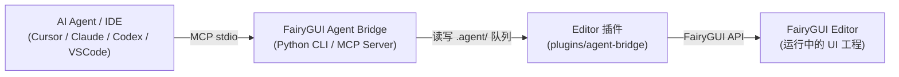

# FairyGUI Agent Bridge

通过 MCP (Model Context Protocol) 或 CLI，让 AI 编程 Agent（如 Cursor、Claude、Codex、VS Code 等）以结构化指令直接操作 FairyGUI Editor，实现自动拼 UI 界面、动效制作与一键发布。

- **版本**：`0.8.8`
- **队列协议**：`1.0`
- **已验证 FairyGUI Editor**：`6.1.4`
- **通信方式**：本地 JSON 队列 + MCP stdio

> **说明**：Bridge 仓库与业务 FairyGUI 工程分开存放。FairyGUI 工程只需安装轻量插件；在宿主 IDE 中可按需安装 Skill 提高 AI 操作准确率。

---

## 🏗️ 工作原理



---

## 💡 AI 使用示例

安装完成后，在支持 MCP / Skill 的 AI 对话框中直接输入类似以下指令：

- `帮我制作一个登录界面，包含账号输入框、密码输入框和登录按钮`
- `根据蓝湖 MCP 导出的切图帮我拼出这个背包界面`
- `帮我给 MainMenu 界面的 StartBtn 添加一个弹出的缩放动画效果`
- `帮我检查当前界面的大图图集设置，保存并发布 Lobby 包`

> 若安装了 Skill，也可以通过 `/fgui-agent-bridge 帮我制作一个登录界面` 精准触发。

---

## 依赖要求

- Python `3.10+`
- [uv](https://docs.astral.sh/uv/) 包管理器
- FairyGUI Editor（推荐 `6.1.4`）

---

## 🚀 安装指南

### 方式一：AI 智能安装（推荐）

将下面的提示词发送给能够操作本地终端和文件的 AI 编程 Agent（如 Cursor、Claude Code、Codex 等）：

```text
请帮我在这台电脑上完整安装 FairyGUI Agent Bridge。你可以执行终端命令和编辑本地文件，请实际完成安装，不要只给操作说明。

源仓库：https://github.com/Wilson520403/fgui-agent-bridge.git
目标 FairyGUI 工程：优先从当前工作区自动查找 .fairy 文件；找不到或找到多个时停下来询问我。
目标代码仓库：当前工作区；
```

---

### 方式二：手动安装

#### 1. 克隆 Bridge 仓库并准备环境

```bash
git clone https://github.com/Wilson520403/fgui-agent-bridge.git
cd fgui-agent-bridge
uv sync --frozen
```

#### 2. 安装 FairyGUI Editor 插件

运行同步脚本，在弹出的窗口中选择你的 FairyGUI 工程目录：

```bash
uv run python scripts/sync_to_project.py --choose-project --apply
```

也可以直接通过命令行指定路径安装：

```bash
uv run python scripts/sync_to_project.py \
  --project /ABSOLUTE/PATH/TO/FAIRYGUI-PROJECT \
  --apply
```

> **注意**：
> - 插件将安装到目标工程的 `plugins/agent-bridge/`。
> - 安装完成后，**请重新打开 FairyGUI 工程**以加载插件。
> - 插件运行时目录 `.agent/` 会在工程内自动创建，请将其加入 `.gitignore`，不要提交到 Git。

#### 3. 配置 MCP Server

你可以根据所使用的 AI 客户端添加 MCP 配置。通用配置格式如下（可参考 [.mcp.example.json](.mcp.example.json)）：

```json
{
  "mcpServers": {
    "fgui": {
      "command": "uv",
      "args": [
        "run",
        "--project",
        "/ABSOLUTE/PATH/TO/fgui-agent-bridge",
        "fgui-agent-mcp"
      ],
      "env": {
        "FGUI_PROJECT_PATH": "/ABSOLUTE/PATH/TO/FAIRYGUI-PROJECT"
      }
    }
  }
}
```

**常见客户端配置入口**：

- **Cursor**：在 `~/.cursor/mcp.json` 或项目根目录 `.cursor/mcp.json` 中粘贴上述配置。
- **Claude Desktop**：编辑 `claude_desktop_config.json`（macOS: `~/Library/Application Support/Claude/`，Windows: `%APPDATA%\Claude\`）。
- **Codex CLI**：
  ```bash
  codex mcp add fgui \
    --env FGUI_PROJECT_PATH=/ABSOLUTE/PATH/TO/FAIRYGUI-PROJECT \
    -- uv run --project /ABSOLUTE/PATH/TO/fgui-agent-bridge fgui-agent-mcp
  ```
- **VS Code (Cline / Roo Code)**：在扩展的 MCP Settings 中添加名为 `fgui` 的 stdio 服务。

#### 4. 验证连接

启动 FairyGUI Editor 并打开目标工程，然后执行：

```bash
uv run --project /ABSOLUTE/PATH/TO/fgui-agent-bridge \
  fgui-agent --project /ABSOLUTE/PATH/TO/FAIRYGUI-PROJECT ping
```

若返回 `{"status": "ok", ...}` 则表明连接成功。

---

### 可选：安装 Agent Skill

Skill 可以让 AI 更好地遵循 FairyGUI 的属性规范与动画约定。使用同步脚本可一键将 Skill 同步至目标业务代码仓库：

```bash
uv run python scripts/sync_to_project.py \
  --project /ABSOLUTE/PATH/TO/FAIRYGUI-PROJECT \
  --skill-root /ABSOLUTE/PATH/TO/YOUR-CODE-REPOSITORY \
  --apply
```

或手动将 `.agents/skills/fgui-agent-bridge/` 目录复制到目标代码仓库的 `.agents/skills/` 目录下。

---

## 🔄 检查与拉取更新

当 Bridge 源仓库有功能更新或 Bug 修复时，可通过一条命令自动从源仓库安全拉取最新代码（`git pull --ff-only`）、同步 Python 环境（`uv sync`），并将最新插件与 Skill 刷新到目标工程：

```bash
# 从源仓库拉取最新代码并同步到 FairyGUI 工程与业务代码仓库
uv run python scripts/sync_to_project.py \
  --pull \
  --project /ABSOLUTE/PATH/TO/FAIRYGUI-PROJECT \
  --skill-root /ABSOLUTE/PATH/TO/YOUR-CODE-REPOSITORY \
  --apply

# 或通过 CLI update 子命令执行
uv run fgui-agent --project /ABSOLUTE/PATH/TO/FAIRYGUI-PROJECT update --pull --apply
```

> **提示**：
> - `fgui_status` 会自动比对当前 Bridge 服务端与 FairyGUI 编辑器内运行的插件版本，若版本不一致会在状态中返回 `updateWarning` 提示。
> - 若插件文件被更新，请在 **FairyGUI Editor 中重新打开工程**以加载新版插件。

---

## 🛠️ 常用 CLI 指令

在 `fgui-agent-bridge` 仓库根目录下执行（也可以通过 `--project PATH` 指定工程）：

```bash
# 状态与连接检查
uv run fgui-agent status
uv run fgui-agent ping

# 查看工程与资源结构
uv run fgui-agent project
uv run fgui-agent packages
uv run fgui-agent items ViewHub
uv run fgui-agent open ViewHub ViewHubBtnItem
uv run fgui-agent active
uv run fgui-agent tree

# 历史与保存
uv run fgui-agent save
uv run fgui-agent undo
uv run fgui-agent redo

# 发布资源
uv run fgui-agent publish --scope active
```

**创建与导入资源**：

```bash
uv run fgui-agent create-component ViewHub NewPanel --width 1920 --height 1080
uv run fgui-agent import-image ViewHub /absolute/path/button.png
uv run fgui-agent import-font ViewHub /absolute/path/font.ttf
uv run fgui-agent import-sound ViewHub /absolute/path/click.mp3
uv run fgui-agent create-movieclip ViewHub Loading --frame /path/01.png --frame /path/02.png --fps 12
uv run fgui-agent create-button ViewHub NewButton --mode common
uv run fgui-agent upsert-transition '{"name":"fadeIn","frameRate":60,"items":[{"type":"Alpha","frame":0,"tween":{"duration":12,"start":0,"end":1}}]}'
uv run fgui-agent preview-transition play fadeIn
```

---

## 🧩 MCP 工具一览

| 类别 | 工具名称 | 功能描述 |
| :--- | :--- | :--- |
| **连接与定位** | `fgui_status`、`fgui_ping`、`fgui_use_project`、`fgui_get_project`、`fgui_list_packages`、`fgui_list_items` | 检查连接状态、动态切换工程、查看包列表与包内资源 |
| **文档与对象** | `fgui_open_document`、`fgui_get_active_document`、`fgui_get_tree`、`fgui_select_object`、`fgui_insert_object`、`fgui_set_property`、`fgui_remove_object` | 打开组件、查看对象树、选中元件、修改属性及增删显示对象 |
| **资源创建/导入** | `fgui_create_component`、`fgui_create_button`、`fgui_import_image`、`fgui_import_font`、`fgui_import_sound` | 新建组件/按钮，从本地绝对路径导入图片、字体与声音 |
| **MovieClip 序列帧** | `fgui_create_movieclip`、`fgui_get_movieclip`、`fgui_update_movieclip`、`fgui_remove_movieclip` | 从本地图片序列创建/更新序列帧动画（直接嵌入 `.jta`） |
| **Transition 动效** | `fgui_list_transitions`、`fgui_get_transition`、`fgui_upsert_transition`、`fgui_remove_transition`、`fgui_add_transition_item`、`fgui_update_transition_item`、`fgui_remove_transition_item` | 声明式增改整段过渡动效，或原子化修改特定轨道关键帧 |
| **动画预览** | `fgui_preview_animation` | 在编辑器中实时播放、暂停、停止、跳帧预览 Transition 或 MovieClip |
| **保存与事务** | `fgui_get_history`、`fgui_undo`、`fgui_redo`、`fgui_save_document`、`fgui_save_all`、`fgui_discard_document` | 属性与操作撤销/重做、保存文档或放弃全部未保存修改 |
| **发布** | `fgui_get_publish_settings`、`fgui_publish` | 查询发布设置、执行资源发布（支持活动包/指定包/全部包） |

---

## ⚙️ 关键机制与规范

### 1. Transition 动效规范
- **全轨道支持**：覆盖 `XY`、`Size`、`Pivot`、`Scale`、`Skew`、`Alpha`、`Rotation`、`Color`、`Animation`、`Visible`、`Sound`、`Transition`、`Shake`、`ColorFilter`、`Text`、`Icon` 全部原生轨道。
- **时间单位**：统一使用 FairyGUI frame 帧单位。
- **事务性**：整段声明式更新或关键帧原子操作均进入事务栈，支持 `fgui_undo` / `fgui_redo`。

### 2. MovieClip 序列帧机制
- 接收有序本地图片列表，通过 FairyGUI `AniData.ImportImages` 嵌入 `.jta` 文件，不会在包内产生多余的散图 `ui://`。
- FPS 范围 `1..255`，支持 Repeat Delay、每帧 Delay、Speed 与 Swing。
- 已有 MovieClip 的更新支持文件快照回退；全新创建/删除属于磁盘级操作，删除时需显式提供 `force=true` 且无外部引用。

### 3. 大图自动独立图集规则
- **规则触发**：图片分辨率达到 `1920×1080`，或任意一边达到 `2048`（2K）时，会自动标记为 FairyGUI `alone` 单独纹理集。
- **自动补齐**：通过 `fgui_import_image` 导入时即时生效；执行 `fgui_publish` 发布时还会自动扫描目标包并纠正历史大图配置，防止大图与小图碎图混排导致图集膨胀。

---

## ❓ 常见问题与排错 (FAQ)

| 异常现象 | 可能原因 | 解决办法 |
| :--- | :--- | :--- |
| `ping` 提示超时或未连接 | 1. FairyGUI Editor 未启动<br>2. 目标工程未打开<br>3. 插件未安装或未生效 | 1. 打开 FairyGUI Editor 并加载目标工程；<br>2. 检查工程下 `plugins/agent-bridge/main.js` 是否存在；<br>3. 重新打开 FairyGUI 工程以重新加载插件；<br>4. 查看工程根目录 `.agent/bridge.log`。 |
| MCP 客户端找不到工具 | 1. MCP 配置中的绝对路径填写错误<br>2. 客户端未重启会话 | 1. 检查 MCP 配置文件中的 `fgui-agent-bridge` 和工程绝对路径；<br>2. 新建 Agent 对话或重启 IDE 重新加载 MCP。 |
| 导入资源失败 | 传入了相对路径或文件不存在 | 确保传入的图片/音频路径为**本地绝对路径**。 |
| 发布操作阻塞超时 | 发布正在进行中或发生了并发请求 | 发布期间部分读写操作会被锁定，请勿并发调用发布；等待完成后检查发布日志。 |

---

## ⚠️ 当前限制

- **兼容基线**：以 FairyGUI Editor `6.1.4` 为主要验证版本。
- **动画类型**：支持 FairyGUI 原生 Transition、MovieClip，以及已有包内 Spine 的 Loader3D 属性操作与组件截图；不支持 DragonBones、SWF、外部 Spine 导入或 Unity 运行时换装。
- **资源管理边界**：暂不支持通用包内资源的任意重命名与跨包移动；MovieClip 删除需带引用校验与 `force=true`。
- **平台环境**：macOS 已做完整端到端验证；Windows 建议在标准命令提示符/PowerShell 下验证路径格式。

---

## 🔄 升级与同步

```bash
git pull
uv sync --frozen
uv run python scripts/sync_to_project.py --choose-project --apply
```

> **提示**：也可以直接对你的 Agent 说 `“/fgui-agent-bridge 帮我更新”`。更新插件后重新打开 FairyGUI 工程即可。只有当 Bridge 仓库路径或启动命令变更时才需更新 MCP 配置。

---

## 🛠️ 开发与维护

- **插件 TypeScript 源码**：`plugin/main.ts`
- **插件运行时编译文件**：`plugin/main.js`
- **Python MCP & CLI**：`src/fairygui_agent/`
- **Agent Skill**：`.agents/skills/fgui-agent-bridge/`
- **同步脚本**：`scripts/sync_to_project.py`

> **维护注意**：修改 `plugin/main.ts` 后必须重新生成并提交 `plugin/main.js`；版本升级需同步修改 `plugin/package.json`、`pyproject.toml`、Python `__version__` 以及插件源码版本号。

---

## 🔗 相关生态推荐

- [蓝湖 MCP (lanhu-mcp)](https://github.com/dsphper/lanhu-mcp)：配合本工具，可以让 AI 编程 Agent 自动从蓝湖设计稿下载切图、导出标注，并直接在 FairyGUI 中拼装好 UI 界面并发布。

---

## 📄 许可证

[MIT License](LICENSE)

## Loader3D / Spine 与组件视觉验证（0.8.5）

- `fgui_get_loader3d(object_id|object_path|object_name, include_asset_info=true)`：读取资源、动画、皮肤、播放和布局信息；列表不可用时返回原因。
- `fgui_set_loader3d(..., resource_url?, animation_name?, skin_name?, playing?, loop?, frame?, save=false, verify=true, skip_name_validation=false)`：仅修改当前文档直属 Loader3D；嵌套对象请先打开所属组件。仅支持已导入包内 Spine，DragonBones 不在首版范围。缺省保持原值，空字符串清除，不支持 Agent undo/redo。
- 修改前加载资源与校验名称，等待最长 8 秒；跨帧期间拒绝冲突命令，文档/对象/属性变化或工程关闭使请求失效。跳过名称校验不能绕过加载失败、超时或资源类型校验。
- 修改后 Editor 拒绝时尽力恢复原属性并返回回退结果；保存失败报告磁盘状态不确定，不宣称回滚或持久化成功。`verify_document` 支持 `resourceURL`、`animationName`、`skinName`、`playing`、`loop`、`frame`；类型为 `loader3d`。
- `fgui_capture_document(scale=1, expected_document_url?)`：仅截当前组件，以 MCP 图像块返回。scale 最大 4，单边最大 4096，总像素最大 8388608，PNG 最大 16 MiB。仅写工程 `.agent/captures/`，超过一天的本工具截图会清理。
- 成功获取图片为 `pending_review`，仍需 Agent 观察。视觉上大体正确即可，检查资源、位置、大小、皮肤、遮挡与可见性，不要求动画帧或像素与效果图完全一致。
- 获取图片失败返回 `manual_required`、原因和人工检查指引，**必须要求用户自行验证，保留已完成修改，不自动 undo/discard**。结构、持久化与视觉结论分别报告。
- `spineCaptureSupported` 是已测捕获路径的能力信息（6.1.4 实测），`spinePresentInTree` 仅表示存在资源；`spineCaptured=null` 表示本次图像尚需观察，不能由对象树自动判定成功。
- CLI 对应 `get-loader3d --id ID`、`set-loader3d --id ID '{"skinName":"default"}' --save`、`capture-document --scale 1`。CLI 返回截图文件元数据，MCP 才返回图像块。
- 不自动发布 UI 包，不验证 Unity 运行时换装。实机结果和限制见 `tests/reports/spine-visual-validation.md`。

截图实现先以独立 UpdateContext 更新组件，消除 Editor 外层视口裁剪，再 GetScreenShot；finally 恢复 Stage 渲染并释放返回纹理。该处理已用高于视口的混合组件验证。

## 0.8.5 审查修复与 SpineFixer

- 新增 `fgui_fix_spine_anchor(url? | package_name + item_name/item_path)`，对应 CLI `fix-spine-anchor URL`。可在现有导入流程结束后独立调用；本轮没有增加 Spine 文件导入接口。
- 算法来自工程 `SpineFixer`：读取 Spine **4.2 二进制 .skel** 的导出包围盒，宽高四舍五入，按原点比例和 Y 轴翻转换算 anchor，设置 `pma=false`。Editor 6.1.4 对小数锚点向零截断，MCP 显式使用相同宿主语义并回读校验。
- 版本未知、头部截断、非有限值、零/负包围盒或整数越界明确失败，不猜测尺寸，不回退到默认 100×100。其它 Spine 版本或 JSON 格式暂不自动修复。
- `fgui_set_loader3d(resource_url=..., fix_spine=true)` 与 `fgui_insert_object(..., fix_spine=true)` 默认先修复 Spine；仅调整播放/皮肤而未传 resource_url 时不隐式修复。只读 get/capture 不写资源。
- 修复会保存**所属包的元数据**（与原 SpineFixer 一致），并回读 package.xml。该资源写入独立于组件 `save=false`，不能由文档 undo/discard 回滚。结果用 `resourceFix` 分开报告；组件后续失败也保留已完成资源修复的信息。
- 可显式传 `fix_spine=false`，CLI 为 `--no-fix-spine`，沿用已修复资源或自行处理不支持版本。旧插件缺少修复能力时拒绝默认自动修复请求，不会静默忽略参数。
- Loader3D 实际修改后清空旧 Agent undo/redo；校验失败、无变化操作保留原历史。保存失败仍清空旧历史；完整回退恢复写入前的 dirty 状态。MCP 原生 undo/redo 回退保持未保存 Loader3D 修改标记，保存或放弃后结束该保护。
- 异步响应在认领请求时固定目标工程目录，成功/失败回调不使用可能已切换的全局目录。
- PNG 除块 CRC 外，还验证有界 zlib 解压、完整流、精确扫描行长度与滤波器值。支持 Unity 非交错 8-bit 灰度/RGB/灰度 Alpha/RGBA 截图；坏图或其它编码转 `manual_required`，要求用户自行验证，不回滚修改。
- 验证与文件索引见 `tests/reports/spine-fixer-review-fixes.md`。

## Controller 基础编辑（0.8.6）

| MCP 工具 | 参数与作用 |
| --- | --- |
| `fgui_get_controllers` | 读取当前文档根组件所有控制器，包含页面 ID/名称/索引、当前页及只读 homePage 信息 |
| `fgui_create_controller` | `name, page_names?, save=false`；缺省创建空控制器，指定页面时自动选中第一页 |
| `fgui_add_controller_page` | `controller_name, name, save=false`；末尾追加，已有 ID 与顺序保留，空控制器的首个页面自动选中 |
| `fgui_rename_controller_page` | `controller_name, name, page_id?/page_name?/page_index?, save=false`；只改名称，保留页面 ID |
| `fgui_set_controller_page` | `controller_name, page_id?/page_name?/page_index?, save=false`；通过原生 setter 应用 Gear/联动 |

页面定位三选一，优先使用稳定的 `page_id`；索引从 0 开始，重复名称拒绝按名称定位。新名称不允许空白、逗号或控制字符，同一控制器中新建页面名称不能重复。控制器名称必须唯一。嵌套组件需先打开所属文档，不开放删除控制器/页面或页面重排；Gear 和联动配置编辑见下节。

默认只修改 Editor 内存；`save=true` 保存整个组件并回读实际 XML 中的控制器页面及 selected 字段。切换当前页不会修改运行时 `homePage`；Editor 重开文档可能按首页规则重选页面，不能将当前页保存当作运行时首页设置。实际改动清空旧 Agent undo/redo，不支持完整 Controller/Gear 联动撤销；未保存内容可通过 discard 放弃整个文档。无变化操作不清历史，但显式保存后清历史。写入或保存失败报告实际状态，不假装联动已回滚。

CLI：`controllers`、`create-controller State --pages Idle Active --save`、`add-controller-page State Disabled`、`rename-controller-page State Enabled --page-id 1`、`set-controller-page State --page-index 1 --save`。全局 `--project` 放在子命令前。没有新增删除命令。

验证结果及文件索引：`tests/reports/controller-basic-editing.md`。

## Gear 编辑（0.8.7）

新增 `fgui_get_gears`、`fgui_set_gear`，对应 CLI `get-gears` / `set-gear`。只操作当前文档直属子对象；先读取已有配置，再按稳定页面 ID 编辑。

| gear_type | 配置 |
| --- | --- |
| `display` | `visible_page_ids=["1"]`：仅列出的页面可见；**空数组表示所有页面可见**，这是原生 GearDisplay 语义，不表示全部隐藏 |
| `text` | 默认值和页面值为字符串，支持空串、换行和 XML 特殊字符；原生 `values` 用竖线分隔，暂不接受包含竖线字符（U+007C）的文本（反斜线也不能转义） |
| `icon` | 字符串：工程内图片 `ui://` URL，空串清除；用于 Loader、Button 等具有图标语义的对象 |
| `xy` | `{x, y}`，整数像素；暂不编辑已有百分比位置 Gear |
| `size` | `{width, height, scaleX?, scaleY?}`，宽高非负整数，省略缩放为 1 |
| `color` | `{color: "#RRGGBB", strokeColor?: "#RRGGBB"}`，省略描边为黑色；不编辑 Alpha |

除 display 外，`default_value` 与 `page_values` 必须显式提供；`page_values` 格式为 `[{"pageId":"0","value":...}]`，允许空数组，未列出的页使用默认值。坐标/尺寸/缩放绝对值不超过 1000000。重复或不属于目标控制器的页面 ID 会在写入前拒绝；新 Gear 绑定及改绑控制器都通过同一个 set 工具完成。

**set 是目标 Gear 的完整替换，不是页面值补丁。** 会保留其它 Gear，以及目标 Gear 的缓动等附加设置，并在 Editor 回读时验证；不新增缓动配置编辑、解绑或删除 Gear 接口，也不删除控制器页面。读取结果包含六类配置及对象 SupportGear 标记，其它 Gear 以原始 XML 返回；未序列化默认值返回 null，不猜测其值。

默认不保存，`save=true` 保存整个组件并回读该对象全部 Gear XML。实际修改清空旧 Agent 历史并保持未保存标记，没有完整 Gear/联动撤销；保存或写入失败报告实际状态，不假装回滚。无变化且不保存时保留历史。布局关系、文本 autoSize、对象基础 visible、GearDisplay2、缓动或显示锁仍可能影响最终效果，需切页观察；对象树 visible 是基础属性，不能据此单独断言 GearDisplay 的最终可见性。

Python/MCP 调用示例：

```python
fgui_get_gears(object_name="title")
fgui_set_gear("text", "State", object_name="title", default_value="其他",
              page_values=[{"pageId": "0", "value": "待领取"}, {"pageId": "1", "value": "已领取"}], save=True)
fgui_set_gear("display", "State", object_name="badge", visible_page_ids=["1"], save=True)
```

CLI 示例：`set-gear text State '{"defaultValue":"其他","pageValues":[{"pageId":"1","value":"已领取"}]}' --name title --save`。CLI JSON 使用 camelCase；全局 `--project` 放在子命令前。

截图失败仍要求用户人工验证，保留修改。六类 Gear 的实机样本、测试与文件索引见 `tests/reports/gear-editing.md`。

## 控制器联动（0.8.8）

| MCP 工具 | 作用 |
| --- | --- |
| `fgui_get_controller_actions(controller_name)` | 读取联动执行顺序及配置，列出当前/直属子组件可引用的控制器、稳定页面 ID 和当前页 |
| `fgui_upsert_controller_action(controller_name, action, action_index?, save=false)` | 省略索引追加；提供索引则完整替换该条，保留其它联动 |
| `fgui_remove_controller_action(controller_name, action_index, save=false)` | 删除指定联动，其它联动保持顺序；不删除页面 |

`action` 使用以下 JSON 字段：

- 公共：`type`、`fromPageIds`、`toPageIds`。两组页面条件都使用源控制器页面 ID，省略或空数组匹配任意页；两组条件同时满足才执行。
- `type="change_page"`：`objectId`（空串/省略为当前组件，否则为直属子组件 ID）、`controllerName`、`targetPageId`。只支持显式稳定页面 ID，暂不支持跟随索引/名称等特殊值。拒绝自引用和会构成循环的控制器引用；按控制器引用图保守检查，不尝试证明页面条件能否阻断循环。
- `type="play_transition"`：`transitionName`（当前组件中已有 Transition）、`repeat`（默认 1，正整数或 -1 循环）、`delay`（默认 0，0..86400 秒）、`stopOnExit`（默认 false）。退出条件是后续切页不再匹配该 Action；由原生执行器决定停止行为。

索引从 0 开始，不是稳定 ID；增删后重新读取，不复用旧索引。更新是单条完整替换，省略字段恢复默认；返回的 `index`/`xml` 是读取元数据，不放进 `action`。未知类型可以读取、保留或删除，不能通过 upsert 编辑。Action 执行顺序与列表顺序一致；修改配置本身不执行联动，也不停止已经播放的动画。

默认仅修改当前根组件内存；`save=true` 保存整个父组件并回读 XML，校验联动内容和顺序。子组件只作为引用目标，不写其资源文件。实际修改清空旧 Agent 历史，不支持完整撤销；失败报告实际状态、保留修改，不自动回滚。删除页面和控制器仍不开放。

**Editor 编辑模式与运行预览不同**：切页可应用控制器/Gear，但 Editor 6.1.4 的普通编辑模式不自动播放 Action 中的 Transition；原生运行预览才会播放。`fgui_preview_animation` 可独立检查动画，不能代替联动触发验收。在运行预览中验证主控制器切页、子组件状态、动画进入/退出；获取截图失败时要求人工验证，不回滚。

```python
fgui_get_controller_actions("Main")
fgui_upsert_controller_action("Main", {
    "type": "change_page", "toPageIds": ["1"],
    "objectId": "childId", "controllerName": "State", "targetPageId": "1"
})
fgui_upsert_controller_action("Main", {
    "type": "play_transition", "toPageIds": ["1"],
    "transitionName": "Show", "repeat": 1, "delay": 0, "stopOnExit": True
}, save=True)
```

CLI 对应 `get-controller-actions Main`、`upsert-controller-action Main '<Action JSON>' [--action-index 0] [--save]`、`remove-controller-action Main 0 [--save]`。
